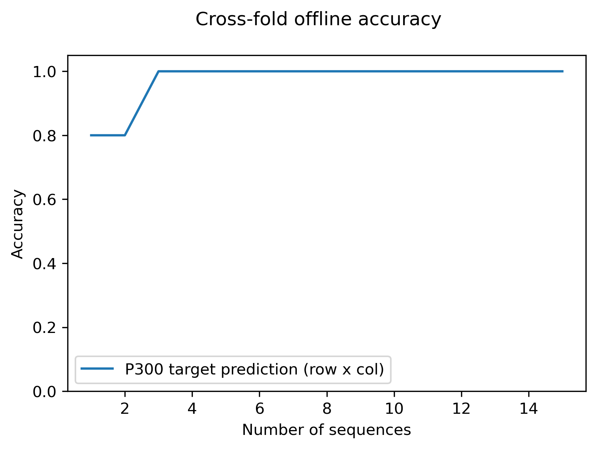

# p3k - yet another offline P300 analysis tool

From BCI2000 and OpenVibe P300 Speller. Based on [mne-python](https://github.com/mne-tools/mne-python)

- Supported bci software
  - BCI2000 ([BCI2kReader](https://github.com/neurotechcenter/BCI2kReader) by @markusadamek)
  - OpenVibe
- Preprocessing features
  - REST infinity rereferencing
  - artifact subspace reconstruction ([meegkit](https://github.com/nbara/python-meegkit) by @nbara)
  - current source density (CSD)
  - Artifact rejection channel/trial based
- ERP visualization
  - Target vs Non-target plots and topographic maps
  - signed r-square heatmaps ([wyrm](https://github.com/bbci/wyrm) by @bbci)
- Classification
  - cross-fold shrinkage LDA
- Sample Data
  - OpenVibe P300 provided in `./data_sample`


|                    signed r-square maps                         |                     offline classification                |
| :----------------------------------------------------------: | ------------------------------------------------------------ |
|  |  |


# Requirements

- OpenViBE ( for converting to gdf)
- python 3.7+
- If you want to use **Artifact Subspace Reconstruction** you must manually install
  - `pip install "git+https://github.com/nbara/python-meegkit"`
  - `pip install statsmodels pyriemann`

## Install via pip

`pip install p3k`

> ## or Install from git
>
> - `git clone https://github.com/lokinou/p3k_offline_analysis.git`
> - `cd p3k_offline_analysis`
> - create an anaconda environment `conda env create -f environment.yml python=3.8.1`
> - activate the environment `conda activate p3k`
> - If you want to use Artifact subspace reconstrunction you must install this
>   - `pip install "git+https://github.com/nbara/python-meegkit"`
>   - `pip install statsmodels pyriemann`
> - Install the p3k package `pip install .`
> - Finally, check that p3k works, this should trigger no error `python -c "import p3k"` 

- 

## Usage

#### Test the sample data

```
from p3k.P300Analysis import run_analysis
run_analysis()
```

#### BCI2000 data

Put the file(s) inside a folder

```
from p3k.P300Analysis import run_analysis
from p3k.params import ParamData

# Define the path to data parameter
p_data = ParamData(data_dir='./data_bci2k')

# run the analysis
run_analysis(param_data=p_data)
```

If the electrode names were not defined in the `dat` files, you must specify them manually

```
from p3k.params import ParamChannels
p_channels = ParamChannels(cname=['Fz','FC1','FC2','C1','Cz','C2','P3','Pz','P4','Oz'])
run_analysis(..., param_channels=p_channels)
```

#### OpenVibe data

> Check my [tutorial to convert .ov to .gdf](https://github.com/lokinou/openvibe_to_gdf_tutorial)

OpenVibe to gdf conversion does not carry channel names, and P300 Speller description, we must define them here 

```
from p3k.P300Analysis import run_analysis
from p3k.params import ParamChannels, ParamData, SpellerInfo

# channel
p_channels = ParamChannels(cname=['Fz','FC1','FC2','C1','Cz','C2','P3','Pz','P4','Oz'])

# P300 speller description
speller_info = SpellerInfo(nb_stimulus_rows=7, nb_stimulus_cols=7, nb_seq=10)

# gdf file location
p_data = ParamData(data_dir=r'./data_ov')

# run the analysis
run_analysis(param_data=p_data, param_channels=p_channels, speller_info=speller_info)
```

#### Changing any parameter

If not initialized or passed to `run_analysis()` default parameters apply. You can change them very easily: 

```
from p3k.P300Analysis import run_analysis
from p3k.params import ParamData, ParamPreprocessing, ParamArtifacts, ParamEpochs, ParamLDA, ParamInterface, DisplayPlots, SpellerInfo

p_data = ParamData(data_dir='./data')

# Change the length of the ERP window and baseline
p_epoch = ParamEpochs(time_epoch=(-0.5, 0.8), time_baseline=(-.1, 0))

# Use artifact subspace reconstruction for noisy data, and select another bandpass
p_preproc = ParamPreprocessing(apply_ASR=True, bandpass=(.5, 30))

# Change the number of cross fold to match the number of trials (e.g 8)
p_lda = ParamLDA(nb_cross_fold=8)

# Select which plots to display
p_plots = DisplayPlots(butterfly_topomap=True)

# Visualize a few of those parameters
print(p_epoch)
print(p_plots)

# Launch the analysis
run_analysis(param_data=p_data, param_epoch=p_epoch, param_preprocessing=p_preproc, param_lda=p_lda, param_plots=p_plots)
```

### Output

By default, figures are saved into `./out/<name_first_datafile>/*`

## Accessing the notebook

- Follow the instructions to "Install from git"

- move to the current repository folder `cd %USERPROFILE%\Desktop\p3k_offline_analysis`

- activate the environment `conda activate p3k`

- execute the notebook: `jupyter lab p300_analysis.ipynb`

  - if jupyter lab crashes (win32api error), reinstall it from conda `conda install pywin32 jupyterlab BCI2kReader `

  - > if jupyter lab does not want to work yet, use jupyter notebook instead by executing `jupyter notebook p300_analysis.ipynb`

