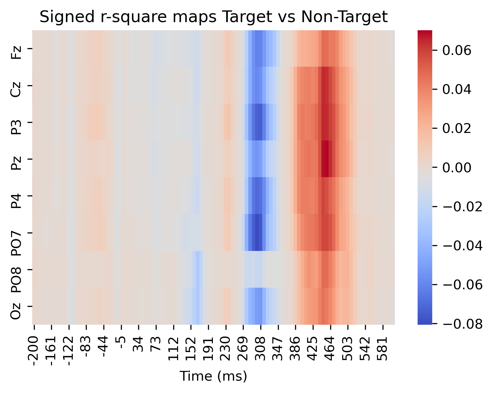

# P300 Analysis from openvibe/BCI2000
**Convert - Plot ERPs - Run LDA - Check Features Map**\
In this jupyter notebook I combined several tools:
- nice preprocessing, epoching and plotting tools from MNE-python, in particular:
  - Current Source Density (CSD)
  - Reference Electrode Standardization Technique (REST) @mne-tools [link](https://github.com/mne-tools/mne-python)
- Riemannian based artifact removal using Artifact Subspace Reconstruction from meegkit package (thanks@nbara) [link](https://github.com/nbara/python-meegkit) 
- Artifact channel and epoch rejection based on variance

The cool stuff it does:
1. Computes P300 ERP plots
2. Computes k-fold Linear Discriminant Analysis with shrinkage
3. Shows signed rsquared plots using wyrm (python port of bbci, thanks @bbci) [link](https://github.com/bbci/wyrm) 

| Signal output                                                | Signed r square output                                       |
| ------------------------------------------------------------ | ------------------------------------------------------------ |
|  |  |

# Requirements

- OpenViBE ( for converting to gdf)
- python 3.8.10(?), MNE, jupyter

## Install python environment

- Download Anaconda Python
- open an anaconda prompt
- move to the current repository folder `cd %USERPROFILE%\Desktop\p300_analysis_from_openvibe`
- create the anaconda environment `conda env create -f environment.yml python=3.8.10`
- *if it does not work, try another version of python*
- activate the environment `conda activate p300mne`
- install additional packages 
  - `pip install "git+https://github.com/nbara/python-meegkit"`
  - `pip install statsmodels pyriemann`
- Check whether mne was installed by pasting this code `python -c "import mne"`. It should trigger no error

## Convert OpenVibe .ov files into gdf files

Check my [tutorial here](https://github.com/lokinou/openvibe_to_gdf_tutorial)

## Accessing the notebook

- move to the current repository folder `cd %USERPROFILE%\Desktop\p300_analysis_from_openvibe`
- activate the environment `conda activate p300mne`
- execute the notebook: `jupyter lab p300_analysis.ipynb`
  - if jupyter lab crashes (win32api error), reinstall it from conda `conda install pywin32 jupyterlab`
  - if jupyter lab does not want to work, use jupyter notebook instead by executing `jupyter notebook p300mne.ipynb`

## Usage

1. Put your `.gdf` or `.dat` files into the `./data_sample` folder
2. Manually enter the electrode names
3. Tweak further analysis parameters as will (resampling, preprocessing)
4. Execute all cells
5. figures are saved into `./out`

